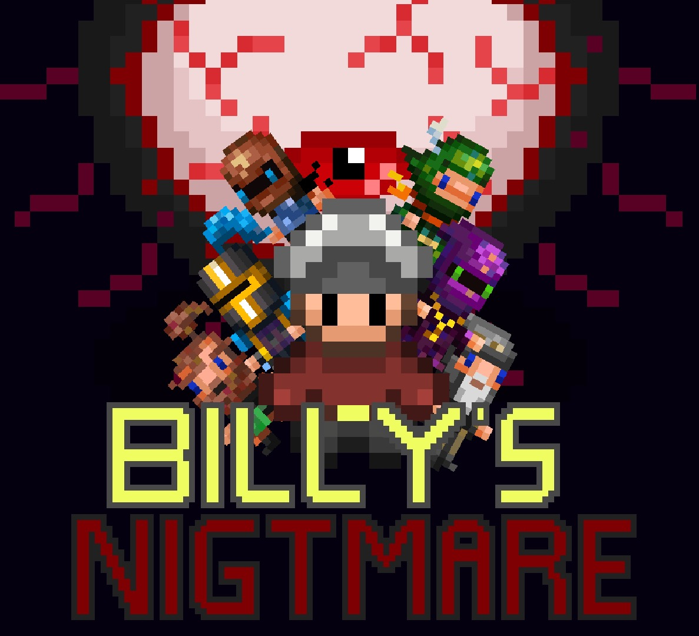
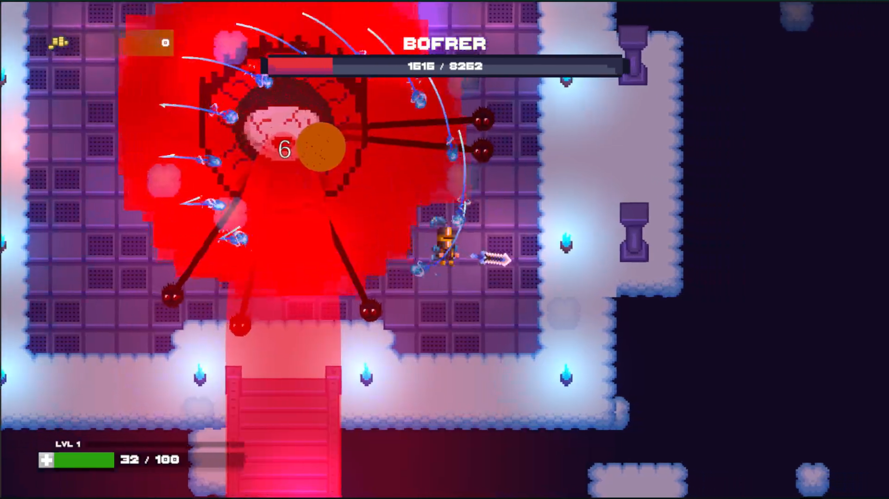
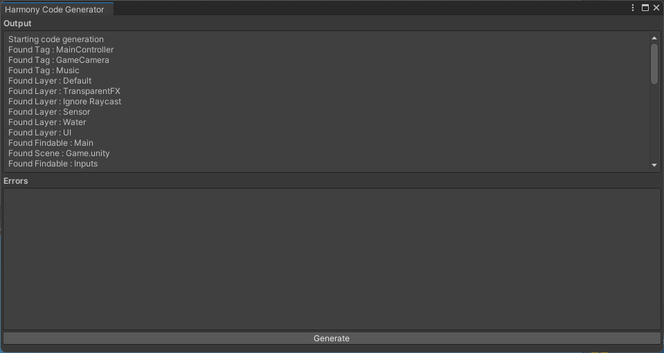
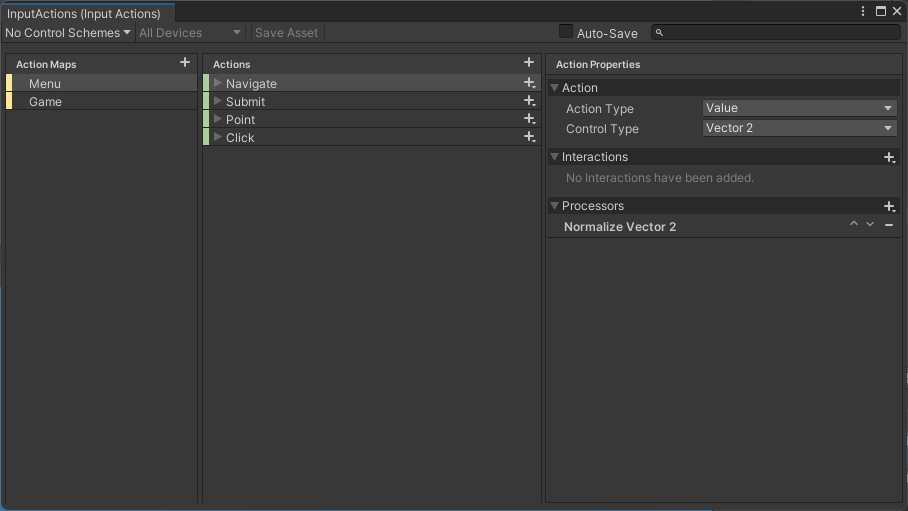
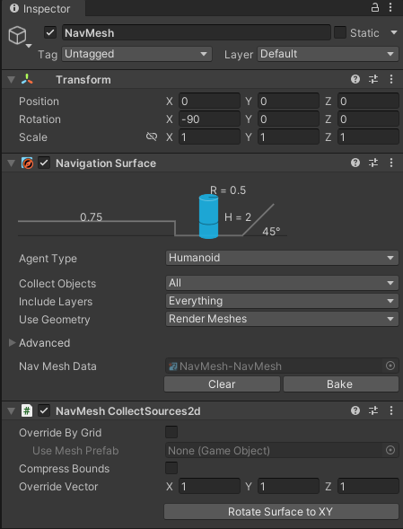

<div align="center">



# Billy's Nightmares

</div>


Projet de jeu vidéo sur Unity pour l'épreuve synthèse de programme des Techniques de l'informatique
du Cégep de Sainte-Foy. Ce projet de type "roguelike", en 2D "top-down", suit l'histoire de Billy, le protagoniste. À travers ses combats variés, il cherche à vaincre Bobby, son beau-frère. Cependant, des portails l'éloignant de ce dernier rendent sa quête d'autant plus difficile et dangereuse. Bref, êtes-vous prêt à mourir?


<div align="center">



</div>

## Installation


Téléchargez la dernière version [stable du jeu][Stable Download]. Décompressez l'archive dans un dossier et exécutez
le programme `ProjetSynthese.exe`. Notez que vous aurez à naviguer au travers de quelques sous-dossiers. Sous Windows,
vous aurez aussi un avertissement de sécurité que vous pouvez ignorer en cliquant sur le lien *Informations 
complémentaires* de la fenêtre.

## Démarrage rapide

Ces instructions vous permettront d'obtenir une copie opérationnelle du projet sur votre machine à des fins de 
développement.

### Prérequis


* [Git] - Système de contrôle de version. Utilisez la dernière version.
* [Rider] ou [Visual Studio] - IDE. Vous pouvez utiliser également n'importe quel autre IDE: assurez-vous simplement 
  qu'il supporte les projets Unity.
* [Unity 2022.2.3f1] - Moteur de jeu. Veuillez utiliser **spécifiquement cette version.** Attention à ne pas installer
  Visual Studio une seconde fois si vous avez déjà un IDE.

*Seul le développement sur Windows est complètement supporté.*

### Compiler une version de développement

Clonez le dépôt et ouvrez le projet dans Unity. Ensuite, ouvrez la scène `Main` et appuyez sur le bouton *Play*.

Attention! Puisque le nombre de package et d'asset est considérable, la première ouverture du projet via Unity peut prendre un certain temps.

### Compiler une version stable

Ouvrez le projet dans Unity. Ensuite, allez dans `File | Build Settings` et compilez le projet **dans un dossier vide**.

## Développement

Ces instructions visent à documenter comment contribuer au développement de certaines parties du projet. Les décisions
architecturales importantes seront aussi décrites ici.

### Fichiers auto-générés

Ce projet contient une bonne quantité de code généré automatiquement. Par exemple, la classe `Tags` est générée 
automatiquement à partir des *Tags* du projet Unity. Cependant, la génération en elle-même n'est pas automatique et
doit être lancée manuellement. Pour ce faire, accédez au menu `Tools | Harmony | Code Generator`. Une fenêtre devrait
s'ouvrir où vous pourrez générer le code lorsque nécessaire. 

Il est à noter que ce code est envoyé sur le dépôt. Soyez donc prudents lors des fusions entre les différentes branches
et préférez regénéner le code en cas de doutes.



Le générateur de code en lui-même est un exécutable externe et fait partie du *package* `Harmony`. Pour plus 
d'informations sur ce qu'il fait, consultez le [dépôt officiel][Harmony Code Generator].

### New Input System

Afin de simplifier la gestion des entrées, le [New Input System] est utilisé au lieu de celui intégré au moteur. Le 
fichier de configuration des entrées se trouve dans `Assets/Settings/InputActions`. Pour plus d'informations sur le 
nouveau *Input System*, consultez son [manuel d'utilisation][New Input System].

Il est à noter que ce fichier génère lui aussi du code C# (voir la classe `InputActions`) et que ce dernier est lui 
aussi inclus dans le dépôt. Soyez donc prudent lors des fusions.



### NavMesh

Puisque Unity ne donne pas de solution direct pour l'utilisation d'un navmesh, ce projet utilise une [extension][NavMesh] pour compléter les composants de base. 

Il est à noter que cette extension est crucial au déplacement de certain personnage, et donc au jeu. Pour que l'extension fonctionne comme voulu, veuillez installer la version 1.1.1(25 octobre 2022) de AI Navigation via Window > PackageManager > Unity Registry. De plus, si une scène possède un objet du nom NavMesh, veuillez vérifier que la rotation est x soit bien à -90, et que le NavMesh Data soit "bake".



## Intégration Continue

Ce projet utilise [GitLab CI] pour effectuer de l'intégration continue avec les images *Docker* fournies par [GameCI].
Pour fonctionner, ces images ont besoin d'une license *Unity* valide. Cette license doit être ajouté dans la
variable d'environnement `UNITY_LICENSE` pour le projet. 

Voici comment récupérer ce fichier de licence. Premièrement, dans une machine avec *Docker*, exécutez la commande 
suivante. Remplacez le contenu des variables `UNITY_USERNAME` et `UNITY_PASSWORD` par les informations de connexion
pour le compte à utiliser.

```shell
docker run -it --rm \
-e "TEST_PLATFORM=linux" \
unityci/editor:2022.2.2f1-windows-mono-1 \
bash -c \
"unity-editor \
-batchmode \
-nographics \
-createManualActivationFile \
-username \"$UNITY_USERNAME\" -password \"$UNITY_PASSWORD\" > /dev/null; \
cat /*.alf"
```

Vous aurez en sortie un fichier XML. Placez le tout dans un fichier nommé `Unity3d.alf`, que vous utiliserez pour 
effectuer l'activation manuelle sur le site de Unity (voir `https://license.unity3d.com/manual`). En retour, vous 
obtiendrez un fichier `Unity_v20XX.x.ulf` dont le contenu doit être mis dans la variable `UNITY_LICENSE` du projet.

## Tester le projet

Vous êtes fortement encouragés à tester [la dernière version][Develop Download] de développement du jeu. Si vous 
rencontrez un bogue, vous êtes priés de le [signaler][Submit Bug] et de fournir une explication détaillée du problème 
avec les étapes pour le reproduire. Les captures d'écran et les vidéos sont les bienvenues.

## Contribuer au projet

Veuillez lire [CONTRIBUTING.md](CONTRIBUTING.md) pour plus de détails sur notre code de conduite.

## Auteurs


* **Gabriel Bertrand** - *Programmeur, interface utilisateur, cinématiques*
* **Kéven Champagne** - *Programmeur, menus, rythme du jeu*
* **Marc-Antoine Girard-Gagnon** - *Programmeur, mécanique de combat, conception du boss final*
* **Charles Côté** - *Programmeur, conception des ennemis, gestion des sons*

## Remerciements

[//]: # (TODO : Remercier toute personne ou groupe ayant contribué au projet, mais qui n'est pas un auteur.)

* [GameCI] - Images Docker d'intégration continue pour *Unity*.
* [ElvGames] - Assets varié utilisé (décors, ennemis...)
* [RANTA GRAPHICS] - Assets du personnage armé de diverse arme
* [h8man] - NavMesh Unity pour projet 2D
* [TinyWonder] - Utilisé pour faire l'interface utilisateur

[//]: # (Hyperliens)
[Git]: https://git-scm.com/downloads
[Rider]: https://www.jetbrains.com/rider/
[Visual Studio]: https://www.visualstudio.com/fr/
[Unity 2022.2.3f1]: https://unity3d.com/fr/get-unity/download/
[Harmony Code Generator]: https://gitlab.com/harmony-unity/code-generator
[New Input System]: https://docs.unity3d.com/Packages/com.unity.inputsystem@1.0/manual/index.html
[GitLab CI]: https://docs.gitlab.com/ee/ci/
[GameCI]: https://game.ci/
[ElvGames]: https://assetstore.unity.com/publishers/71020
[RANTA GRAPHICS]: https://assetstore.unity.com/publishers/24285
[h8man]: https://github.com/h8man
[NavMesh]: https://github.com/h8man/NavMeshPlus
[TinyWonder]: https://butterymilk.itch.io/tiny-wonder-gui-pack


[Submit Bug]: https://gitlab.com/Bodeje/projet-synthese-jv/-/issues/new?issuable_template=Bug
[Stable Download]: https://gitlab.com/Bodeje/projet-synthese-jv
[Develop Download]: https://gitlab.com/Bodeje/projet-synthese-jv/-/tree/dev
